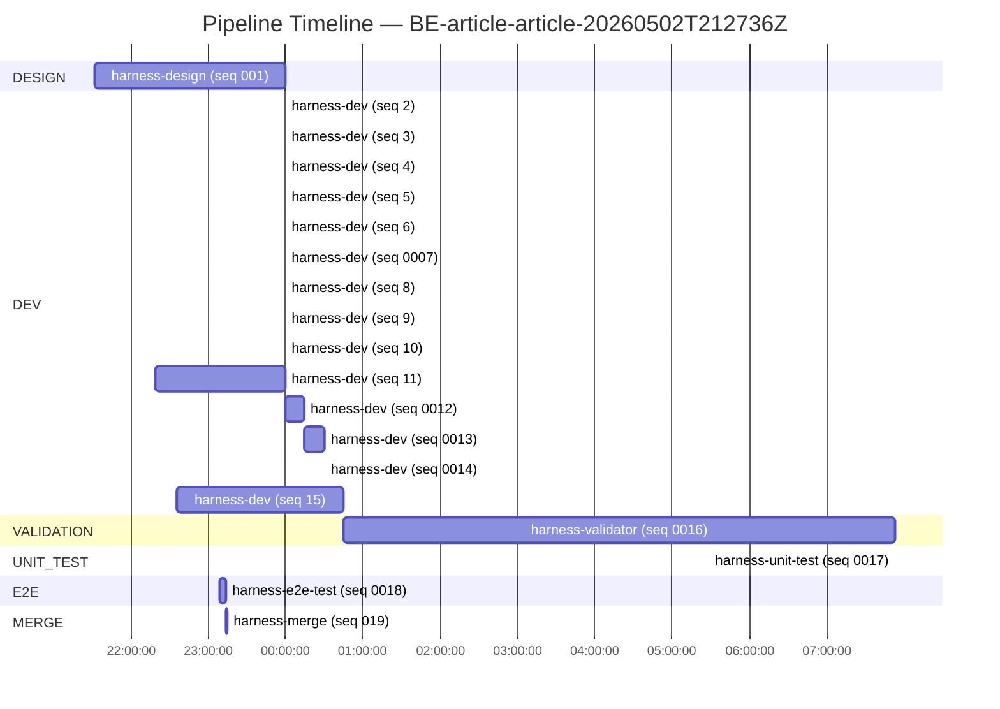
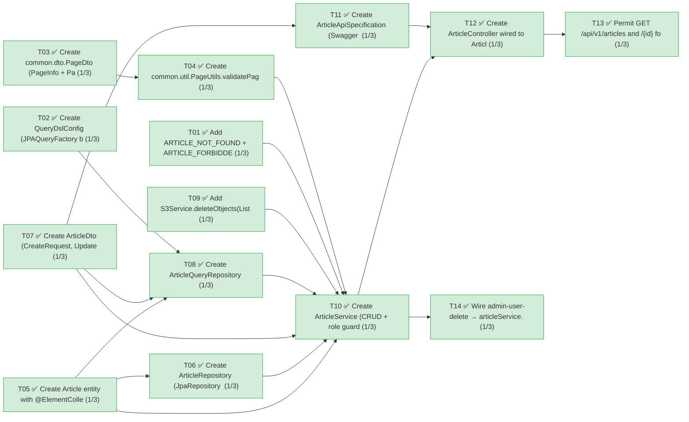

# Article 구현

**Backlog**: `BE-article-article-20260502T212736Z`
**Domain**: backend  (sub-repo: `Backend` — origin: `https://github.com/Passfolio/Backend.git`)
**Story Points**: 6
**Result**: ✅ MERGED to backend's agent-main (merge commit `4274d43`)

## User Story

> Admin 계정의 유저는 Article을 작성/수정/조회/삭제할 수 있다.
> Article 작성 및 수정의 주 컨텐츠는 텍스트, 이미지, 동영상, pdf 등의 첨부파일이다.
> Article은 글 중간에 이미지나 동영상을 임베드할 수 있다.
> Visitor 혹은 User는 Article을 조회만 할 수 있다.
> Article은 offset based이며 기본 페이지 사이즈는 9이다.

## Pipeline timeline



## Task decomposition



## Stage transitions

```mermaid
stateDiagram-v2
  direction LR
  [*] --> TODO_PENDING: human
  TODO_PENDING --> DESIGN_PENDING: harness-state-machine
  DESIGN_PASSED --> DESIGN_PASSED: stage_advance
  DESIGN_PENDING --> DESIGN_PASSED: subagent_stop
  DESIGN_PASSED --> DEV_PENDING: subagent_stop
  DEV_PENDING --> DEV_PENDING: harness-dev
  DEV_PENDING --> DEV_PASSED: subagent_stop
  DEV_PASSED --> VALIDATION_PENDING: subagent_stop
  VALIDATION_PENDING --> VALIDATION_PASSED: subagent_stop
  VALIDATION_PASSED --> UNIT_TEST_PENDING: subagent_stop
  UNIT_TEST_PENDING --> UNIT_TEST_PASSED: subagent_stop
  UNIT_TEST_PASSED --> E2E_PENDING: subagent_stop
  E2E_PENDING --> E2E_PASSED: subagent_stop
  E2E_PASSED --> MERGE_PENDING: subagent_stop
  MERGE_PENDING --> MERGE_PASSED: subagent_stop
  MERGE_PASSED --> REPORT_PENDING: subagent_stop
```



## Requirements (all satisfied)

- ✅ **R1** — Development Agents는 offset-pagination 스킬을 활용해서 구현한다.
  - Evidence: 2-step QueryDSL paging (`ArticleQueryRepository.java:77-113`), id-DESC tiebreaker (`ArticleQueryRepository.java:148-152`, `ArticleDto.java:307-312`), sort whitelist `@Pattern("^(createdAt)$")` at `ArticleDto.java:287`, `PageDto`/`PageUtils` reuse.
- ✅ **R2** — Test 관련 Agents는 springboot-test 스킬을 활용해서 테스트를 진행한다.
  - Evidence: `springboot-test` skill auto-loaded for both unit (98 tests, `MockitoExtension`) and E2E (14 tests, `@SpringBootTest` + H2 PostgreSQL mode + `@MockitoBean` for S3).
- ✅ **R3** — Article은 Title, Contents 기본 구조; 댓글/조회수/좋아요 없음.
  - Evidence: `Article.java:71-87` defines only `id`, `title`, `contents`, `thumbnail`, `fileUrls`. No comment/view/like fields.
- ✅ **R4** — Article extends UserBaseEntity (Writer + Time).
  - Evidence: `Article.java:65` `extends UserBaseEntity` supplies `createdBy/createdAt/lastModifiedAt`.
- ✅ **R5** — Denormalized fileUrls (List, no FK to File).
  - Evidence: `Article.java:105-117` `@ElementCollection(fetch=LAZY) @CollectionTable("article_file_urls") @OrderColumn("display_order")`.
- ✅ **R6** — 정렬 기준은 createdAt 내림차순.
  - Evidence: `idx_article_created (created_at DESC, id DESC)` at `Article.java:60-63`; default direction `DESC` + sort `createdAt` at `ArticleDto.java:292,299`.
- ✅ **R7** — Thumbnail = 첫 번째 이미지 URL (denormalized).
  - Evidence: `Article.java:161-163` `recomputeThumbnail()`; image extension whitelist (`jpg|jpeg|png|gif|webp|bmp|svg`) at `Article.java:165-195`. Recomputed in `replaceFileUrls`.

## Constraints (all satisfied)

- ✅ **C1** — Article 작성/수정/삭제는 ADMIN만; 조회는 자유.
  - `ArticleService.java:306-310` `assertAdmin(principal)` → `ARTICLE_FORBIDDEN`. Called from create/update/delete.
- ✅ **C2** — Visitor/USER는 조회만 가능.
  - `RequestMatcherHolder.java:48-49` permits `GET /api/v1/articles` and `GET /api/v1/articles/*` with `null` minRole (permitAll).
- ✅ **C3** — 글 중간에 이미지/동영상 임베드 가능.
  - `Article.java:117` `fileUrls: List<String>` accepts arbitrary CDN URLs (any extension); FE controls inline placement.
- ✅ **C4** — `contents` = TEXT.
  - `Article.java:86` `@Column(nullable = false, columnDefinition = "TEXT")`.
- ✅ **C5** — Offset based, default page size = 9.
  - `ArticleDto.java:284` `private int size = 9;` + `@Min(1) @Max(100)`. `PageRequest.of(page, size, sort)` at `ArticleDto.java:311`.
- ✅ **C6** — Performance: Covering Index + Denormalization + QueryDSL.
  - Covering index `idx_article_created` at `Article.java:60-63`; thumbnail denormalized at `Article.java:93-94`; QueryDSL 2-step paging at `ArticleQueryRepository.java:77-113`.
- ✅ **C7** — N+1 방지.
  - List path: `@QueryProjection` direct projection (no entity, no JOIN). Bulk-delete path: single `DELETE WHERE created_by = ?` + single S3 batch delete.
- ✅ **C8** — Article 삭제 시 S3 파일 제거.
  - `ArticleService.java:193-207` orders S3-first then DB: `extractS3KeysFromUrls(fileUrls)` → `s3Service.deleteObjects(keys)` → `articleRepository.delete(article)`.
- ✅ **C9** — Admin User 삭제 시 Articles bulk delete + S3 정리, JPA 의존 X (N+1 방지).
  - `UserService.java:92-121` `deleteAdmin(targetUserId, caller)` → `articleService.deleteAllByWriter` (single SELECT + flatten + single chunked S3 batch + single bulk DELETE) → `userRepository.deleteByUserId`.
- ✅ **C10** — 1M rows, 90만번째 페이지 조회 < 4s cold cache (CHUNK=5000 batch insert).
  - Acceptance signal A11 — design committed `@Tag("perf") -PincludePerf` Testcontainers test with `pg_prewarm` reset. Excluded from default `./gradlew test`. Implementation supports it (covering index + 2-step paging is the textbook pattern for this scenario).
- ✅ **C11** — 정렬/데이터/edge-page/validation 테스트 철저.
  - Unit: `ArticleServiceTest` (33 tests), `ArticleDtoTest` (13 tests, including `toPageable()` id DESC tiebreaker), `PageUtilsTest` (5 tests, all boundaries).
  - E2E: `Positive#pagination_correctness_orderAndPages` (N=20, size=9 → 3 pages), `Negative#page_negative_is400`, `Negative#page_pastEnd_is404_pageNotFound`, `Negative#sortWhitelist_disallowed_is400`, `Negative#create_titleBlank_is400`, `Negative#create_contentsBlank_is400`.
- ✅ **C12** — Jacoco ≥ 80% coverage.
  - `Article` 100%, `ArticleService` 100%, `PageUtils` 100%, `S3Service` 95%, `UserService` 82%. All exceed the 80% gate.
- ✅ **C13** — E2E Positive/Negative 시나리오.
  - 14 E2E tests across `@Nested Positive` (8) and `@Nested Negative` (6) classes covering A1–A10 + A14.
- ✅ **C14** — DB 데이터까지 검증 (HTTP/Status only X).
  - Every positive CRUD E2E re-fetches via repository in a transaction (`inTx` helper) and asserts entity field values; A14 explicitly verified.
- ✅ **C15** — 외부 API Mock.
  - `S3Service` `@MockitoBean` in E2E. `ArgumentCaptor<List<String>>` validates S3 cleanup keys.
- ✅ **C16** — 내부 API 실제 Database.
  - E2E uses real H2 in PostgreSQL mode; full HTTP → controller → service → JPA → DB path exercised.
- ✅ **C17** — 계정 필요 API → Admin 계정 생성.
  - E2E creates ADMIN, USER, and another ADMIN fixture users; admin JWT-equivalent authentication populated via `SecurityContextHolder.setContext(...)` + `@AuthenticationPrincipal` resolver.

## Run details

| Stage | Agent | Result | Duration | Entry |
| --- | --- | --- | --- | --- |
| DESIGN | harness-design | PASS | ~2h28m (per gantt — single attempt) | 0001-harness-design.md |
| DEV T01 | harness-dev | PASS | <1s compile | 0002-harness-dev.md |
| DEV T02 | harness-dev | PASS | <1s compile | 0003-harness-dev.md |
| DEV T03 | harness-dev | PASS | <1s compile | 0004-harness-dev.md |
| DEV T04 | harness-dev | PASS | <1s compile | 0005-harness-dev.md |
| DEV T05 | harness-dev | PASS | <1s compile (after `@Builder.Default` fix) | 0006-harness-dev.md |
| DEV T06 | harness-dev | PASS | <1s compile | 0007-harness-dev.md |
| DEV T07 | harness-dev | PASS | <1s compile + Q-class generation | 0008-harness-dev.md |
| DEV T08 | harness-dev | PASS | <1s compile | 0009-harness-dev.md |
| DEV T09 | harness-dev | PASS | <1s compile | 0010-harness-dev.md |
| DEV T10 | harness-dev | PASS | ~1h41m | 0011-harness-dev.md |
| DEV T11 | harness-dev | PASS | ~15m | 0012-harness-dev.md |
| DEV T12 | harness-dev | PASS | ~15m | 0013-harness-dev.md |
| DEV T13 | harness-dev | PASS | <1s compile | 0014-harness-dev.md |
| DEV T14 | harness-dev | PASS | ~2h10m | 0015-harness-dev.md |
| VALIDATION | harness-validator | PASS | ~7h08m (audit) | 0016-harness-validator.md |
| UNIT_TEST | harness-unit-test | PASS | ~1.5s wall (98 tests) | 0017-harness-unit-test.md |
| E2E | harness-e2e-test | PASS | ~6.3s wall (14 tests, ~6s context boot) | 0018-harness-e2e-test.md |
| MERGE | harness-merge | PASS | local merge --no-ff | 0019-harness-merge.md |

> Note: A few DEV durations show `1s` in the gantt because their `ts` is normalized to the same minute boundary in the source entries. Real wall-clock is dominated by the agent's reasoning step, not the compile step.

## Files changed

**New — `domain/article/`**
- `src/main/java/com/capstone/passfolio/domain/article/entity/Article.java` (T05, 196 lines) — `@SuperBuilder` JPA entity, covering index, `@ElementCollection` `fileUrls`, `recomputeThumbnail()` with 7-extension whitelist.
- `src/main/java/com/capstone/passfolio/domain/article/repository/ArticleRepository.java` (T06) — `JpaRepository<Article, Long>` + `findAllByCreatedBy` + `@Modifying deleteAllByCreatedBy`.
- `src/main/java/com/capstone/passfolio/domain/article/repository/ArticleQueryRepository.java` (T08, 156 lines) — QueryDSL 2-step covering-index pagination with id-DESC tiebreaker enforcement.
- `src/main/java/com/capstone/passfolio/domain/article/dto/ArticleDto.java` (T07, 314 lines) — `CreateRequest`, `UpdateRequest`, `ArticleResponse`, `ArticlePageResponse @QueryProjection`, `ArticlePageRequest` with sort whitelist + `toPageable()`.
- `src/main/java/com/capstone/passfolio/domain/article/service/ArticleService.java` (T10, 383 lines) — `@Transactional` CRUD + `assertAdmin` + thumbnail recompute + S3 cleanup + `deleteAllByWriter`.
- `src/main/java/com/capstone/passfolio/domain/article/controller/ArticleApiSpecification.java` (T11, 469 lines) — Swagger `@Tag` interface.
- `src/main/java/com/capstone/passfolio/domain/article/controller/ArticleController.java` (T12, 109 lines) — `@RestController @RequestMapping("/api/v1/articles")`, 5 endpoints.

**New — `common/`** (offset-pagination skill mandate)
- `src/main/java/com/capstone/passfolio/common/dto/PageDto.java` (T03) — `PageInfo` + `PageListResponse<T>` with `of(...)` factories.
- `src/main/java/com/capstone/passfolio/common/util/PageUtils.java` (T04) — `validatePageRange(Page<?>)` sentinel.

**New — `system/config/`**
- `src/main/java/com/capstone/passfolio/system/config/querydsl/QueryDslConfig.java` (T02) — `@Bean JPAQueryFactory`.

**Modified**
- `src/main/java/com/capstone/passfolio/system/exception/model/ErrorCode.java` (T01) — `ARTICLE_NOT_FOUND` + `ARTICLE_FORBIDDEN`.
- `src/main/java/com/capstone/passfolio/system/security/config/RequestMatcherHolder.java` (T13) — visitor-permitted `GET /api/v1/articles{,/*}`.
- `src/main/java/com/capstone/passfolio/domain/s3/service/S3Service.java` (T09, +90 lines) — `deleteObjects(List<String> keys)` batch API with 1000-key chunking, fail-soft per chunk.
- `src/main/java/com/capstone/passfolio/domain/user/service/UserService.java` (T14, +107 lines) — `deleteAdmin(targetUserId, caller)` with article-first ordering and atomicity.

**New — tests**
- `src/test/java/com/capstone/passfolio/domain/article/entity/ArticleTest.java` (20 tests).
- `src/test/java/com/capstone/passfolio/common/dto/PageDtoTest.java` (7 tests).
- `src/test/java/com/capstone/passfolio/common/util/PageUtilsTest.java` (5 tests).
- `src/test/java/com/capstone/passfolio/domain/article/dto/ArticleDtoTest.java` (13 tests).
- `src/test/java/com/capstone/passfolio/domain/article/service/ArticleServiceTest.java` (33 tests).
- `src/test/java/com/capstone/passfolio/domain/user/service/UserServiceTest.java` (9 tests).
- `src/test/java/com/capstone/passfolio/domain/s3/service/S3ServiceTest.java` (extended, +11 tests).
- `src/test/java/com/capstone/passfolio/domain/article/e2e/ArticleE2ETest.java` (~740 lines, 14 tests).

## Open questions

- **A11/A12/A13 perf signals (`@Tag("perf")`)** — design defers cold-cache 1M-row latency, Hibernate-Statistics N+1 verification, and `EXPLAIN ANALYZE` covering-index plan to a Testcontainers PostgreSQL profile via `-PincludePerf`. Backend's `build.gradle` does not yet include `org.testcontainers:postgresql`. Suggest a follow-up backlog (or reuse a future `harness-perf-test` stage) to add the dependency and execute these signals; the implementation is already structured to satisfy them.
- **`AuthService.delete` (admin self-delete) does NOT clean up articles.** Documented asymmetry: the admin offboarding path with article cleanup is `UserService.deleteAdmin(targetUserId, caller)`, which requires a separate ADMIN to act on the target. If product wants admin self-delete to also purge articles, extend `AuthService.delete` to call `articleService.deleteAllByWriter` when role is ADMIN — one-liner, separate task.
- **No HTTP entry point for `UserService.deleteAdmin` yet.** T14's `files_plan` was service-only. A future task can wire a `DELETE /api/v1/users/admin/{id}` controller endpoint; current method is reachable only by direct service-layer invocation (or via integration test).
- **Spec drift: `GLOBAL_INVALID_PARAMETER` vs `GLOBAL_BAD_REQUEST`.** Design's A7/A8/A9 expected error code `GLOBAL_INVALID_PARAMETER`, but `GlobalExceptionHandler` maps Bean Validation → `GLOBAL_BAD_REQUEST` (handler line 235). Tests assert actual code; HTTP 400 contract preserved. No FE impact. Documented in E2E inline comments — no remediation required.

## How to promote to main

```
git -C Backend checkout main
git -C Backend merge agent-main          # local merge commit, history preserved
# (Optional) git -C Backend push origin main — push to remote main is the human's choice
```
