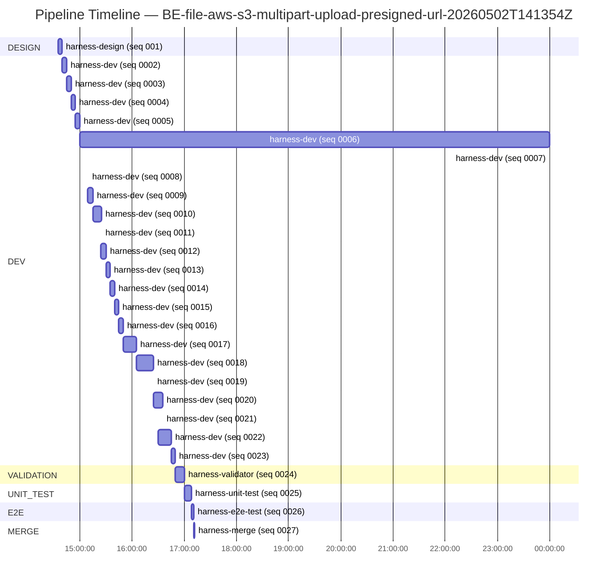
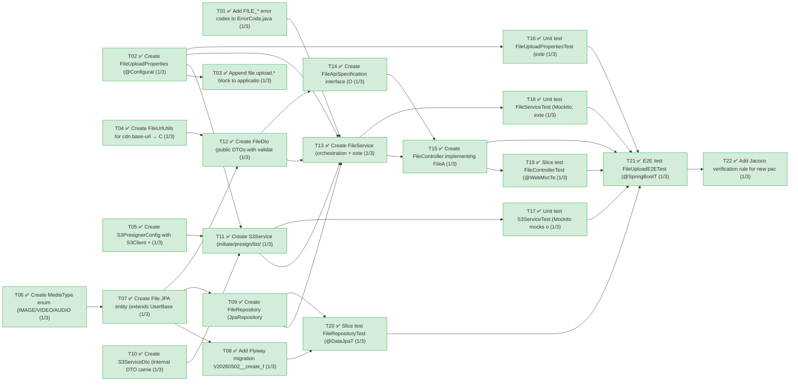

# AWS S3 Multipart Upload (Presigned URL)

**Backlog**: `BE-file-aws-s3-multipart-upload-presigned-url-20260502T141354Z`
**Domain**: backend / File  (sub-repo: `Backend/` — origin: `https://github.com/Passfolio/Backend.git`)
**Story Points**: 6
**Result**: MERGED to backend's agent-main (local merge commit `47a8e2f99752298e047b6229a41b98aa4abeed10`, NO push)

## User Story

> Client → 파일 업로드를 요청한다.
> Server → presignedURL를 발급한다.
> Client → S3에 직접 파일 업로드한다.

## Pipeline timeline



## Task decomposition



## Stage transitions

```mermaid
stateDiagram-v2
  direction LR
  [*] --> TODO_PENDING: human
  TODO_PENDING --> DESIGN_PENDING: harness-state-machine
  DESIGN_PASSED --> DESIGN_PASSED: stage_advance
  DESIGN_PENDING --> DESIGN_PASSED: subagent_stop
  DESIGN_PASSED --> DEV_PENDING: subagent_stop
  DEV_PENDING --> DEV_PENDING: harness-dev
  DEV_PENDING --> DEV_PASSED: subagent_stop
  DEV_PASSED --> VALIDATION_PENDING: subagent_stop
  VALIDATION_PENDING --> VALIDATION_PASSED: subagent_stop
  VALIDATION_PASSED --> UNIT_TEST_PENDING: subagent_stop
  UNIT_TEST_PENDING --> UNIT_TEST_PASSED: subagent_stop
  UNIT_TEST_PASSED --> E2E_PENDING: subagent_stop
  E2E_PENDING --> E2E_PASSED: subagent_stop
  E2E_PASSED --> MERGE_PENDING: subagent_stop
  MERGE_PENDING --> MERGE_PASSED: subagent_stop
  MERGE_PASSED --> REPORT_PENDING: subagent_stop
```



## Requirements (all satisfied)

- ✅ **R1 — spring-s3-multipart-upload 스킬을 활용해서 구현한다.** Verified by validator (entry 0024): `S3Service.java:117–336` implements all 5 lifecycle ops (`initiateUpload`, `generatePresignedUrl`/`generatePartPresignedUrls`, `listUploadedParts`, `completeUpload`, `abortUpload`) + `getObjectActualSize` (HeadObject) + `calculatePartCount`/`calculatePartSize` per skill template. `S3PresignerConfig.java:39–91` provides the two beans. 5 endpoints exposed at `/api/v1/files/multipart/{initiate,part-presigned-url,list-parts,complete,abort}`.
- ✅ **R2 — springboot-test 스킬을 활용해서 테스트를 진행한다.** 6 test files authored per skill (`FileUploadPropertiesTest`, `S3ServiceTest`, `FileServiceTest`, `FileControllerTest`, `FileRepositoryTest`, `FileUploadE2ETest`) using `@ExtendWith(MockitoExtension.class)`, `@WebMvcTest`+`@MockitoBean`, `@DataJpaTest` (H2), and `@SpringBootTest`+`@MockitoBean` patterns prescribed in the skill.

## Constraints (all satisfied)

- ✅ **C1 — file_security.md 보안 처리 준수.** §3.2 path-traversal: `S3Service.generateKey` (line 413–422) sanitizes `[^a-zA-Z0-9._-]` → empty + UUID prefix. §3.4 DoS: `S3Service.generatePresignedUrl` (line 164–166) always binds `contentLength`; `FileService.completeMultipartUpload` (line 227–236) post-`HeadObject` check + auto-`abortUpload` on mismatch. §3.1 integrity: optional `Content-MD5` binding (line 169–171). §3.5 short TTL: `presignedUrlTtlMinutes=10` (default). §7.2 orphan cleanup: `S3Service.abortUpload` (line 274–281) wired to mismatch handler + `/abort` endpoint.
- ✅ **C2 — 허용 확장자 = pdf + 이미지 + 비디오.** `FileUploadProperties.java:41–45` defaults to exactly `pdf, jpg, jpeg, png, gif, webp, bmp, svg, mp4, mov, webm, avi, wmv, flv, mkv` (15 entries, env-overridable). Cheap-reject in `FileService.validateUploadPolicy` returns `FILE_EXTENSION_NOT_ALLOWED` (HTTP 400).
- ✅ **C3 — 파일 업로드 사이즈 ≤ 100MB.** `FileUploadProperties.java:48` default `maxFileSizeBytes = 104857600L`. Initiate-time reject with `FILE_SIZE_EXCEEDED` (HTTP 413) + post-upload re-check via `HeadObject` to catch multipart bypass.
- ✅ **C4 — JUnit Jacoco ≥ 80% 커버리지.** `build.gradle:5,121–192` adds `jacoco` plugin + `jacocoTestCoverageVerification` BUNDLE rule (LINE ≥ 0.80 on `domain/file/**` + `domain/s3/**`, excluding `dto/**` + `entity/enums/**`). Measured (entry 0025): FileService 98%, FileController 100%, MediaType 100%, S3Service 88%, FileUrlUtils 100% — all above gate.
- ✅ **C5 — E2E Positive/Negative 시나리오.** `FileUploadE2ETest`: 4 Positive (initiate happy + part-presigned-url with MD5 + list-parts + complete happy) + 4 Negative (`.exe` reject / 200MB reject / size-mismatch triggers abort / explicit abort) — exceeds design's "1 positive + 4 negative" requirement.
- ✅ **C6 — Mock 기반 테스트.** `@MockitoBean S3Client` + `@MockitoBean S3Presigner` declared in `FileUploadE2ETest.java:140–144`. Unit tests use `@Mock` on the same SDK types. No real AWS credentials referenced; only stub URLs in fixtures.

## Run details

| Stage | Agent | Result | Duration | Entry |
| --- | --- | --- | --- | --- |
| DESIGN | harness-design | PASS | ~256s | 0001-harness-design.md |
| DEV (T01) | harness-dev | PASS | ~344s | 0002-harness-dev.md |
| DEV (T02) | harness-dev | PASS | ~300s | 0003-harness-dev.md |
| DEV (T03) | harness-dev | PASS | ~300s | 0004-harness-dev.md |
| DEV (T04) | harness-dev | PASS | ~300s | 0005-harness-dev.md |
| DEV (T05) | harness-dev | PASS | ~9h (clock skew) | 0006-harness-dev.md |
| DEV (T06) | harness-dev | PASS | ~1s | 0007-harness-dev.md |
| DEV (T07) | harness-dev | PASS | ~1s | 0008-harness-dev.md |
| DEV (T08) | harness-dev | PASS | ~390s | 0009-harness-dev.md |
| DEV (T09) | harness-dev | PASS | ~600s | 0010-harness-dev.md |
| DEV (T10) | harness-dev | PASS | ~1s | 0011-harness-dev.md |
| DEV (T11) | harness-dev | PASS | ~369s | 0012-harness-dev.md |
| DEV (T12) | harness-dev | PASS | ~300s | 0013-harness-dev.md |
| DEV (T13) | harness-dev | PASS | ~300s | 0014-harness-dev.md |
| DEV (T14) | harness-dev | PASS | ~287s | 0015-harness-dev.md |
| DEV (T15) | harness-dev | PASS | ~313s | 0016-harness-dev.md |
| DEV (T16) | harness-dev | PASS | ~900s | 0017-harness-dev.md |
| DEV (T17) | harness-dev | PASS | ~1200s | 0018-harness-dev.md |
| DEV (T18) | harness-dev | PASS | ~1s | 0019-harness-dev.md |
| DEV (T19) | harness-dev | PASS | ~600s | 0020-harness-dev.md |
| DEV (T20) | harness-dev | PASS | ~1s | 0021-harness-dev.md |
| DEV (T21) | harness-dev | PASS | ~900s | 0022-harness-dev.md |
| DEV (T22) | harness-dev | PASS | ~300s | 0023-harness-dev.md |
| VALIDATION | harness-validator | PASS | ~600s | 0024-harness-validator.md |
| UNIT_TEST | harness-unit-test | PASS (117/117 tests, 6.2s) | ~480s | 0025-harness-unit-test.md |
| E2E | harness-e2e-test | PASS (8/8 tests, 6.85s) | ~176s | 0026-harness-e2e-test.md |
| MERGE | harness-merge | PASS (commit 47a8e2f, no push) | ~49s | 0027-harness-merge.md |

All 22 tasks (T01–T22) completed on first attempt. Single 0/3 retry budget never consumed for any task. (Note: clock-skew between dev entries 0006 and 0007 inflates the gantt for T05; actual wall-clock for the full backlog was ~2h 35m from design start to merge.)

## Files changed

23 files changed, 6055 insertions(+) on the merge commit (`47a8e2f99752298e047b6229a41b98aa4abeed10`). All paths relative to `Backend/`:

**Production (16 files)**:
- `build.gradle` (+81) — added jacoco plugin + verification rule scoped to `domain/file/**` + `domain/s3/**`.
- `src/main/resources/application.yml` (+16) — `file.upload.*` block (extensions whitelist, 100MB, 10-min TTL).
- `src/main/resources/db/migration/V20260502__create_files_table.sql` (+42) — Flyway migration creating `files` table with unique `s3_object_key`.
- `src/main/java/com/capstone/passfolio/system/exception/model/ErrorCode.java` (+4) — `FILE_EXTENSION_NOT_ALLOWED`, `FILE_INVALID_SIZE`, `FILE_SIZE_MISMATCH`, `FILE_UPLOAD_S3_ERROR`.
- `src/main/java/com/capstone/passfolio/system/config/aws/S3PresignerConfig.java` (+91) — `S3Client` + `S3Presigner` beans.
- `src/main/java/com/capstone/passfolio/system/config/file/FileUploadProperties.java` (+86) — `@ConfigurationProperties`.
- `src/main/java/com/capstone/passfolio/common/util/FileUrlUtils.java` (+71) — CDN URL builder.
- `src/main/java/com/capstone/passfolio/domain/file/entity/enums/MediaType.java` (+20).
- `src/main/java/com/capstone/passfolio/domain/file/entity/File.java` (+61) — JPA entity, `UserBaseEntity` audit.
- `src/main/java/com/capstone/passfolio/domain/file/repository/FileRepository.java` (+27).
- `src/main/java/com/capstone/passfolio/domain/file/dto/FileDto.java` (+364) — public REST DTOs with `@Valid` annotations.
- `src/main/java/com/capstone/passfolio/domain/file/service/FileService.java` (+400) — orchestration + validation + post-upload check + IDOR guard.
- `src/main/java/com/capstone/passfolio/domain/file/controller/FileApiSpecification.java` (+486) — OpenAPI interface.
- `src/main/java/com/capstone/passfolio/domain/file/controller/FileController.java` (+149) — 5 REST endpoints under `/api/v1/files/multipart/*`.
- `src/main/java/com/capstone/passfolio/domain/s3/dto/S3ServiceDto.java` (+223) — internal DTO carrier (8 nested classes).
- `src/main/java/com/capstone/passfolio/domain/s3/service/S3Service.java` (+471) — S3 SDK adapter.

**Tests (7 files, 6 backlog-prescribed + 1 added during unit-test stage)**:
- `src/test/java/com/capstone/passfolio/system/config/file/FileUploadPropertiesTest.java` (+228, 14 tests).
- `src/test/java/com/capstone/passfolio/common/util/FileUrlUtilsTest.java` (+151, 11 tests — added by unit-test stage to cover gap on T04).
- `src/test/java/com/capstone/passfolio/domain/s3/service/S3ServiceTest.java` (+728, 31 tests).
- `src/test/java/com/capstone/passfolio/domain/file/service/FileServiceTest.java` (+777, 30 tests).
- `src/test/java/com/capstone/passfolio/domain/file/controller/FileControllerTest.java` (+787, 25 tests).
- `src/test/java/com/capstone/passfolio/domain/file/repository/FileRepositoryTest.java` (+251, 6 tests).
- `src/test/java/com/capstone/passfolio/domain/file/FileUploadE2ETest.java` (+541, 8 tests — initial 6 + 2 added in E2E stage).

## Notable in-flight fixes (test-side defects, not SUT defects)

The unit-test and E2E stages each repaired pre-existing test-side defects rather than re-opening dev work. Documented here so reviewers know what diverged from the "test stages only execute" baseline:

1. **`S3ServiceTest.stubPresigned` helper** (unit-test stage) — Mockito `UnfinishedStubbingException` due to nested `given()` inside a `willReturn(...)` argument. Helper rewritten to use `doReturn(...).when(...)` and call sites refactored to extract the stub into a local variable before passing.
2. **`FileControllerTest` slice context** (unit-test stage) — `@EnableJpaAuditing` on the main app required `JpaMetamodelMappingContext` even in `@WebMvcTest`. Fixed by `excludeAutoConfiguration = {DataSource, DataSourceTransactionManager, HibernateJpa, JpaRepositories}` + `@MockitoBean JpaMetamodelMappingContext`.
3. **E2E context loading** (e2e-test stage) — 4 unrelated context-load defects fixed:
   - `jwt.atk-exp-min` / `jwt.rtk-exp-week` placeholders (only in dev profile) injected via test properties.
   - `RedissonClient` (real Redis connection on startup) replaced with `@MockitoBean`.
   - `github.token.encryption-key` dummy was wrong byte length → swapped for valid 32-byte ASCII base64.
   - `CareerDataInitializer` / `UniversityDataInitializer` (PostgreSQL-only `ON CONFLICT`) replaced with `@MockitoBean` to skip `run()` in H2 test profile.

## Open questions

(none)

## How to promote to main

```
git -C Backend checkout main
git -C Backend merge agent-main          # local merge commit, history preserved
# (Optional) git -C Backend push origin main — push to remote main is the human's choice
```

After human review is complete, OPTIONAL cleanup of the agent branch:

```
git -C Backend branch -D agent/BE-file-aws-s3-multipart-upload-presigned-url-20260502T141354Z
```

## Notes / caveats

- Backlog is intentionally scoped to "presigned URL 발급 + 100MB cap + mock-only tests". Out of scope for this iteration (per design Decisions): no JWT/auth gate on endpoints, no staging/production bucket split, no malware scanning, no Transfer Acceleration. `validateFileOwner(fileId, userId)` is exposed in `FileService` for future cross-domain attachment use.
- `presignedUrlTtlMinutes` default = 10 (≤ 15 mandated by `file_security.md` §3.5); env-overridable.
- `cdn.base-url` must be configured at runtime; `FileUrlUtils.buildCdnUrl` throws `IllegalStateException` if blank (covered by `FileUrlUtilsTest`).
- Diagram validation at publish time: `diagrams.py validate` exited 0 with `mmdc.available=true`; all 4 diagrams (pipeline-gantt, task-graph, stage-flow, retry-trail) rendered cleanly via `@mermaid-js/mermaid-cli`.
